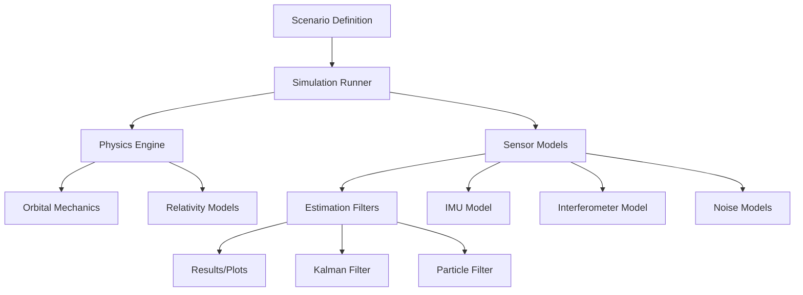
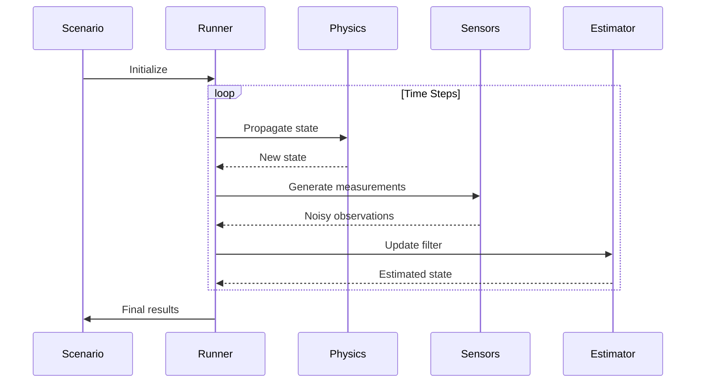

# Architecture

## Overview

OutOfThisWorld is designed as a modular simulation and analysis framework. The architecture separates concerns into distinct modules: physics, sensors, estimation, and simulation orchestration.

## System Architecture

## Module Descriptions

### Physics Module (`src/outofthisworld/physics/`)

**Purpose**: Core physics models for orbital mechanics, units, constants, and relativistic effects.

**Components**:
- `units.py`: Unit conversions and dimensional analysis
- `constants.py`: Physical constants (G, c, etc.)
- `orbital.py`: Two-body propagation, perturbations, coordinate transformations
- `relativity.py`: Post-Newtonian corrections, time dilation, redshift

**Design Principles**:
- Pure functions where possible (no side effects)
- Explicit units (avoid unit confusion)
- Numerical stability (adaptive integrators, regularization)

### Sensors Module (`src/outofthisworld/sensors/`)

**Purpose**: Models of physical sensors and their noise characteristics.

**Components**:
- `imu.py`: IMU bias, noise, random walk models
- `interferometer.py`: Simplified atom interferometer phase measurements
- `noise.py`: Noise generators (white, colored, random walk)

**Design Principles**:
- Realistic noise models (Allan deviation, power spectral density)
- Configurable parameters (bias, scale factors, noise levels)
- Clear separation between true signals and sensor outputs

### Estimation Module (`src/outofthisworld/estimation/`)

**Purpose**: State estimation and sensor fusion algorithms.

**Components**:
- `kalman.py`: Linear and extended Kalman filters
- `particle.py`: Particle filter implementations

**Design Principles**:
- Modular filter interfaces (predict, update, reset)
- Support for nonlinear dynamics and measurements
- Uncertainty quantification (covariance, confidence intervals)

### Simulation Module (`src/outofthisworld/sim/`)

**Purpose**: Orchestration of scenarios, time stepping, and data collection.

**Components**:
- `scenario.py`: Scenario definition (initial conditions, parameters)
- `runner.py`: Main simulation loop, time integration, logging

**Design Principles**:
- Declarative scenario definitions (YAML/JSON support future)
- Flexible time stepping (fixed, adaptive)
- Minimal coupling between modules

## Data Flow

## Extension Points

### Adding New Sensors

1. Create class in `sensors/` module
2. Implement `measure(state: State) -> Measurement` method
3. Add noise model via `noise.py` utilities
4. Register in sensor factory (future)

### Adding New Filters

1. Create class in `estimation/` module
2. Implement `predict()` and `update()` methods
3. Follow interface pattern from `kalman.py`
4. Add tests in `tests/estimation/`

### Adding New Physics Models

1. Add functions to `physics/` modules
2. Keep functions pure (no global state)
3. Document coordinate systems and assumptions
4. Add validation tests

## Configuration

Configuration is centralized in `src/outofthisworld/config.py`:

- Physical constants
- Default sensor parameters
- Simulation settings
- Numerical tolerances

Future: Support for YAML/JSON configuration files.

## Testing Strategy

- **Unit tests**: Each module tested independently
- **Integration tests**: Full simulation scenarios
- **Validation tests**: Compare against known analytical solutions
- **Performance tests**: Benchmark critical paths

## Dependencies

- **numpy**: Numerical arrays and linear algebra
- **scipy**: Integration, optimization, signal processing
- **pytest**: Testing framework
- **ruff**: Linting and formatting
- **mypy**: Type checking

## Future Enhancements

- **Distributed simulation**: Multi-spacecraft scenarios
- **GPU acceleration**: For particle filters and large ensembles
- **Visualization**: Real-time plotting, 3D orbit visualization
- **Data interfaces**: Import/export to standard formats (SPICE, CCSDS)
- **Mission modeling**: Constellation design, communication links

